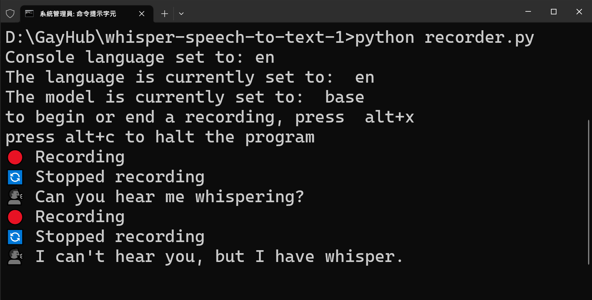

<!-- @format -->

# OpenAI Whisper Speech-to-Text Transcriber

## Overview

This script records audio using a hotkey, saves it as a WAV file, and then transcribes it into text using the OpenAI Whisper model. The transcribed text is automatically typed where your cursor is.

## Screenshots



## Requirements

- Python 3.x
- pyaudio
- wave
- threading
- keyboard
- whisper
- pyautogui
- argparse

You can install these packages using pip:

```bash
pip install -r requirements.txt
```

### ffmpeg

This program requires FFMPEG. The easiest way to install it on Windows is using Chocolatey, a package manager. Here’s how:

- install Chocolatey by following the instructions on the [official website](https://chocolatey.org/install).
- Once Chocolatey is installed, open a command prompt or PowerShell as an administrator.
- Run the following command to install FFMPEG:

```bash
choco install ffmpeg
```

Now, FFMPEG will be installed and automatically added to your system's PATH.

## Usage

### Basic Usage

To run the script, use the following command:

```bash
python recorder.py
```

By default the hotkey to start and end the recording is "alt+x". The program will read in the audio from the first hotkey press to the second hotkey press. After the audio is saved and transcribed, the transcribed audio will be typed out wherever the cursor is currently placed. No need to keep the program shell front and center, the program will continue to monitor the hotkey in the background.

### Custom Hotkey

You can specify a custom hotkey for toggling recording:

```bash
python recorder.py --hotkey '<key-1>+<key-2>'
```

### Custom language

You can specify a custom language for transcribing:

```bash
python recorder.py --language '<language>'
```

### Custom model

You can specify a model for transcribing:

```bash
python recorder.py --model '<model-size>'
```

### Console Language

You can specify a language for the console output:

```bash
python recorder.py --console '<language>'
```

Now supported languages are:

- English (en)
- Chinese (zh)
- Traditional Chinese (zh-tw)
  
#### Run on startup

1. Open the run dialog by pressing `Win+R`.
2. Type `shell:startup` and press enter.
3. Create a shortcut to `run.bat` (or `執行.bat`) in the folder that opens.

## Class `AudioRecorder`

### Methods

- `toggle_recording()`: Toggles the recording state.
- `record()`: Records audio while `self.recording` is True.
- `transcribe_recording()`: Transcribes the recorded audio.
- `save_audio()`: Saves the recorded audio and transcribes it.
- `set_hotkey(hotkey)`: Sets a hotkey for toggling recording.

## License

MIT
